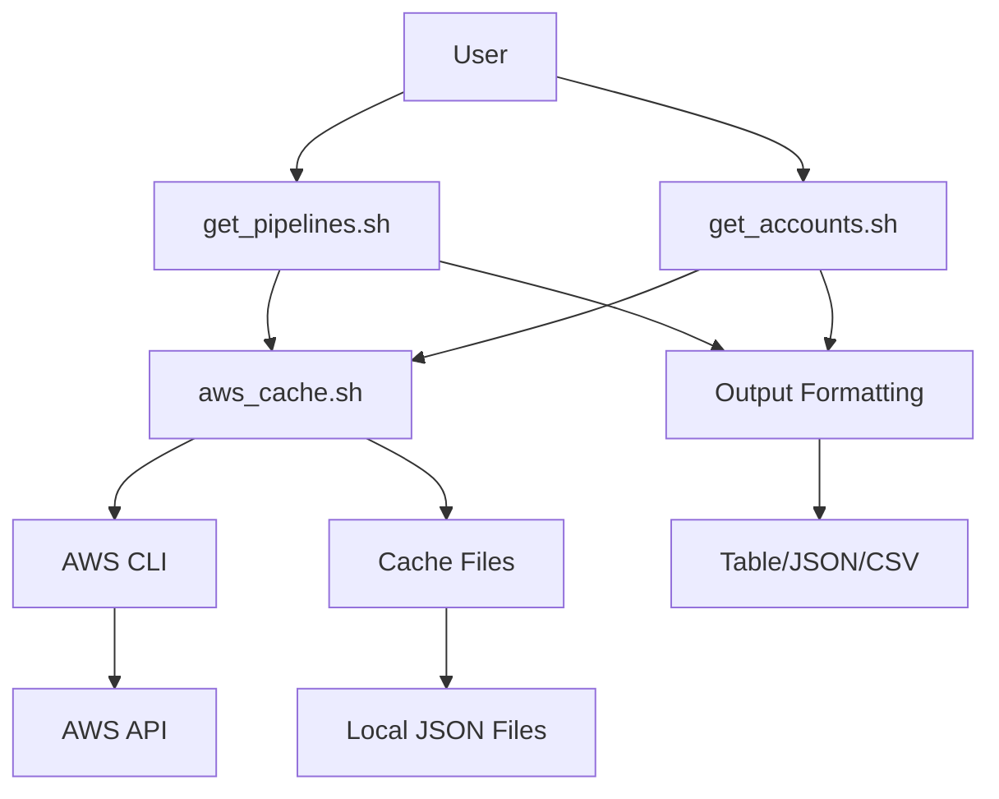

# AFT Operations Toolkit - Project Structure

## 📁 プロジェクト構造

```
aftplan/
├── README.md                    # 🏠 メインドキュメント
├── get_pipelines.sh            # 🔄 パイプライン管理メインツール
├── get_accounts.sh             # 👥 アカウント管理ツール
├── aws_cache.sh                # ⚡ キャッシュシステム
├── pipelines_example.sh        # 📝 パイプライン使用例
├── accounts_example.sh         # 📝 アカウント使用例
├── example_usage.sh            # 📝 基本使用例
├── cache_test_examples.sh      # 🧪 キャッシュテスト例
├── get_pipelines_backup.sh     # 💾 バックアップファイル
├── aws_cache/                  # 📦 キャッシュデータディレクトリ
│   └── *.json                  # キャッシュファイル
├── docs/                       # 📚 ドキュメントディレクトリ
│   ├── README.md               # 📖 ドキュメント一覧
│   ├── README_pipelines.md     # 🔄 パイプライン管理詳細
│   ├── README_accounts.md      # 👥 アカウント管理詳細
│   ├── query_filter_feature.md # 🔍 クエリフィルター機能
│   ├── cache_analysis_improvement.md # 📊 キャッシュ分析改善
│   ├── aws_cache_clear_guide.md # 🧹 キャッシュクリアガイド
│   ├── performance_optimization_summary.md # ⚡ パフォーマンス最適化
│   ├── pipeline_status_logic_update.md # 🔧 ステータスロジック更新
│   ├── statistics_fix_analysis.md # 📈 統計修正分析
│   ├── last_execution_fix_analysis.md # ⏰ 実行時刻修正分析
│   ├── cache_flow_diagram.md   # 🔄 キャッシュフロー図
│   ├── spec.md                 # 📋 システム仕様書
│   └── project_structure.md    # 📁 このファイル
└── .kiro/                      # 🛠️ Kiro IDE設定
    └── specs/                  # 仕様ファイル
```

## 🎯 ファイル分類

### 🚀 実行可能スクリプト
| ファイル | 説明 | 主要機能 |
|---------|------|----------|
| `get_pipelines.sh` | パイプライン管理 | 一覧表示、状態監視、フィルタリング |
| `get_accounts.sh` | アカウント管理 | 一覧表示、組織情報取得 |
| `aws_cache.sh` | キャッシュシステム | API結果キャッシュ、TTL管理 |

### 📝 使用例スクリプト
| ファイル | 説明 |
|---------|------|
| `pipelines_example.sh` | パイプライン管理の使用例 |
| `accounts_example.sh` | アカウント管理の使用例 |
| `example_usage.sh` | 基本的な使用例 |
| `cache_test_examples.sh` | キャッシュ機能のテスト例 |

### 📚 ドキュメント

#### 📖 ユーザーガイド
- `docs/README.md` - ドキュメント一覧とナビゲーション
- `docs/README_pipelines.md` - パイプライン管理の詳細ガイド
- `docs/README_accounts.md` - アカウント管理の詳細ガイド
- `docs/aws_cache_clear_guide.md` - キャッシュ管理ガイド

#### 🔍 機能詳細
- `docs/query_filter_feature.md` - クエリフィルター機能の詳細
- `docs/cache_analysis_improvement.md` - キャッシュ分析機能の改善

#### 🛠️ 技術詳細
- `docs/performance_optimization_summary.md` - パフォーマンス最適化
- `docs/pipeline_status_logic_update.md` - ステータス処理ロジック
- `docs/statistics_fix_analysis.md` - 統計処理の修正
- `docs/last_execution_fix_analysis.md` - 時刻処理の修正

#### 📋 設計資料
- `docs/spec.md` - システム仕様書
- `docs/cache_flow_diagram.md` - アーキテクチャ図
- `docs/project_structure.md` - プロジェクト構造（このファイル）

## 🔄 データフロー



## 🎯 主要機能マップ

### パイプライン管理 (`get_pipelines.sh`)
```
📊 出力形式
├── table (デフォルト)
├── json
└── csv

🔍 フィルタリング
├── ステータス別 (-s)
├── リージョン別 (-r)
└── クエリフィルター (--query)

⚡ パフォーマンス
├── キャッシュ利用
├── TTL管理 (-c)
└── キャッシュ分析 (--analyze-cache)
```

### アカウント管理 (`get_accounts.sh`)
```
👥 アカウント情報
├── 基本情報表示
├── 組織構造
└── ステータス確認

📊 出力オプション
├── table
├── json
└── csv
```

### キャッシュシステム (`aws_cache.sh`)
```
💾 キャッシュ管理
├── 自動キャッシュ
├── TTL管理
├── 強制更新 (-f)
└── キャッシュクリア (--clear)

🔍 分析機能
├── キャッシュ一覧 (--list)
├── 存在確認 (--test)
└── デバッグモード (-d)
```

## 🚀 開発・運用フロー

### 1. 開発フロー
```
1. 機能開発
2. テスト実行
3. ドキュメント更新
4. 使用例作成
```

### 2. 運用フロー
```
1. 定期実行設定
2. キャッシュ最適化
3. パフォーマンス監視
4. エラー対応
```

## 📈 バージョン管理

### ファイル更新履歴
- メインスクリプト: 継続的な機能追加・改善
- ドキュメント: 機能追加に合わせて更新
- 使用例: 新機能の実用例を追加

### 互換性
- 既存のオプションは後方互換性を維持
- 新機能はオプトイン方式で追加
- 破壊的変更は事前告知

---

---

**プロジェクト**: AFT Operations Toolkit (aft-ops-toolkit)  
**最終更新**: 2025年10月7日  
**プロジェクト構造バージョン**: 2.0.0